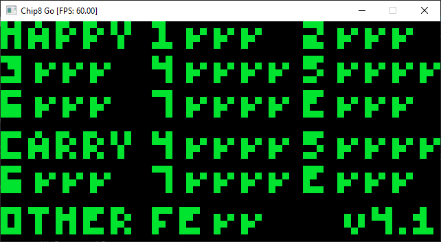

# chip8-emu-go

Yet another [CHIP-8](https://en.wikipedia.org/wiki/CHIP-8) emulator (of emulator) written in Golang. Using [Raylib](https://www.raylib.com/) backend (keybinding and graphics).

## Running
### Requirements

- [Golang](https://go.dev/dl/) >= 1.19

### Get dependencies

```
go get -u github.com/gen2brain/raylib-go/raylib
go get -u github.com/gen2brain/beeep
```
### Running

```
go run main.go <path/to/rom>
```

## Software

- [CHIP-8 test suite](https://github.com/Timendus/chip8-test-suite)
- [Chip-8 Games Pack](https://www.zophar.net/pdroms/chip8/chip-8-games-pack.html)

## Quirks

- `8xy1`/`8xy2`/`8xy3` reset VF
- `8xy6`/`8xyE` vX = vY >>[<<] 1
- `Fx55`/`Fx65` increment I by x

### Corax+ test


### Flags test



### Quirks test


## Key Bindings

```
Chip8 keypad         Keyboard mapping
1 | 2 | 3 | C        num 7 | num 8 | num 9     | num /
4 | 5 | 6 | D   =>   num 4 | num 5 | num 6     | num *
7 | 8 | 9 | E   =>   num 1 | num 2 | num 3     | num -
A | 0 | B | F        num . | num 0 | num Enter | num +
```